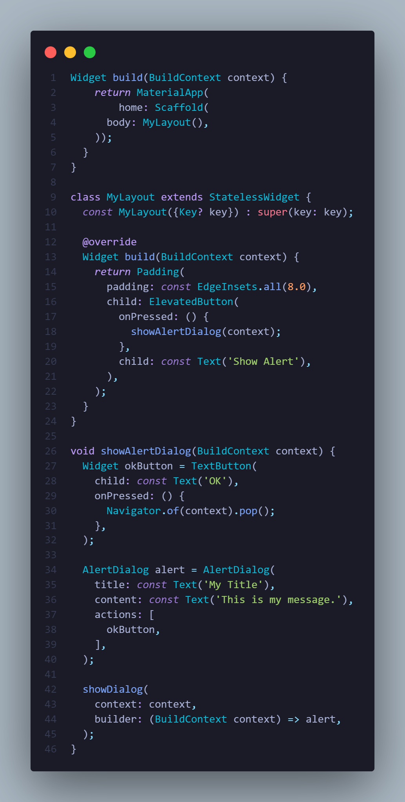

## Pemrograman Mobile - Pertemuan 5

| Nama  | Maulidin Zakaria |
| ----- | ---------------- |
| NIM   | 2241720160       |
| No    | 16               |
| Kelas | TI-3G            |

## Praktikum 1 :

### Langkah 1 : Pilih directory yang ingin digunakan untuk instalasi flutter

### Langkah 2 : Ketik flutter create nama-folder di terminal

### Langkah 3 : Ketik cd nama folder lalu code . untuk membuka folder flutter di code editor anda

### Langkah 4 : Project flutter sudah bisa digunakan.

## Praktikum 2 :

### Langkah 1 : Buka mode developer di pengaturan HP
### Langkah 2 : Aktifkan mode debug USB di opsi developer
### Langkah 3 : Sambungkan HP ke Laptop menggunakan kabel USB
### Langkah 4 : Pada code editor pastikan pilih device HP sebelum menjalankan project flutter
### Langkah 5 : Project flutter sudah bisa ditampilkan lewat HP (Real Device)

## Praktikum 3 :

### Langkah 1 : Login ke akun GitHub Anda, lalu buat repository baru dengan nama "flutter-fundamental-part1"

### Langkah 2 : Lalu klik tombol "Create repository" lalu akan tampil seperti gambar berikut.

### Langkah 3 : Kembali ke VS code, project flutter hello_world, buka terminal pada menu Terminal > New Terminal. Lalu ketik perintah berikut untuk inisialisasi git pada project Anda.

### Langkah 4 : Pilih menu Source Control di bagian kiri, lalu lakukan stages (+) pada file .gitignore untuk mengunggah file pertama ke repository GitHub.

### Langkah 5 : Beri pesan commit "tambah gitignore" lalu klik Commit (✔)

### Langkah 6 : Lakukan push dengan klik bagian menu titik tiga > Push

### Langkah 7 : Di pojok kanan bawah akan tampil seperti gambar berikut. Klik "Add Remote"

### Langkah 8 : Salin tautan repository Anda dari browser ke bagian ini, lalu klik Add remote

### Setelah berhasil, tulis remote name dengan "origin"

### Langkah 9 : Lakukan hal yang sama pada file README.md mulai dari Langkah 4. Setelah berhasil melakukan push, masukkan username GitHub Anda dan password berupa token yang telah dibuat (pengganti password konvensional ketika Anda login di browser GitHub). Reload halaman repository GitHub Anda, maka akan tampil hasil push kedua file tersebut seperti gambar berikut.

### Langkah 10 : Lakukan push juga untuk semua file lainnya dengan pilih Stage All Changes. Beri pesan commit "project hello_world". Maka akan tampil di repository GitHub Anda seperti berikut.

### Langkah 11 : Kembali ke VS Code, ubah platform di pojok kanan bawah ke emulator atau device atau bisa juga menggunakan browser Chrome. Lalu coba running project hello_world dengan tekan F5 atau Run > Start Debugging. Tunggu proses kompilasi hingga selesai, maka aplikasi flutter pertama Anda akan tampil seperti berikut.

### Langkah 12 : Silakan screenshot seperti pada Langkah 11, namun teks yang ditampilkan dalam aplikasi berupa nama lengkap Anda. Simpan file screenshot dengan nama 01.png pada folder images (buat folder baru jika belum ada) di project hello_world Anda. Lalu ubah isi README.md seperti berikut, sehingga tampil hasil screenshot pada file README.md. Kemudian push ke repository Anda.

## Praktikum 4 :

### Langkah 1 : Text Widget digunakan untuk menampilkan teks pada halaman. 

### Langkah 2 : Image Widget digunakan untuk menampilkan gambar 

## Praktikum 5 :

### Langkah 1 : Cupertino Button dan Loading Bar digunakan untuk menampilkan button dan loading animation pada halaman. 

### Langkah 2 : Floating Action Button (FAB) digunakan untuk membuat button yang melayang pada halaman. 

### Langkah 3 : Scaffold Widget digunakan mengatur layout pada halaman yang ditampilkan. 

### Langkah 4 : Dialog Widget digunakan untuk menampilkan modal pada halaman. 

### Langkah 5 : Input Widget digunakan untuk menampilkan text input pada halaman. 

### Langkah 6 : Date and Time Picker digunakan untuk menampilkan date and time picker widget pada halaman.

